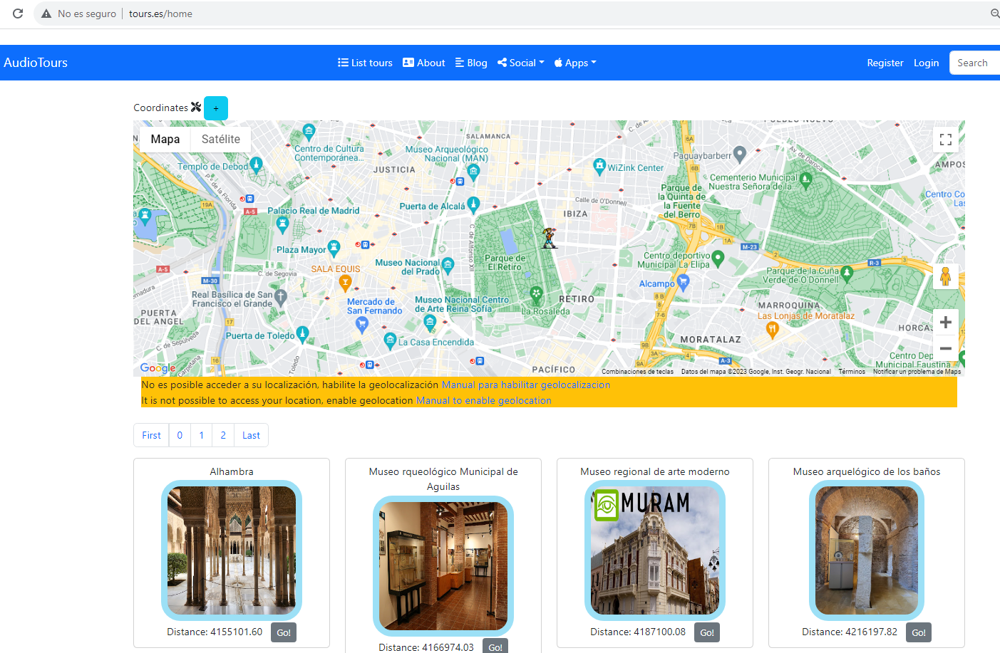
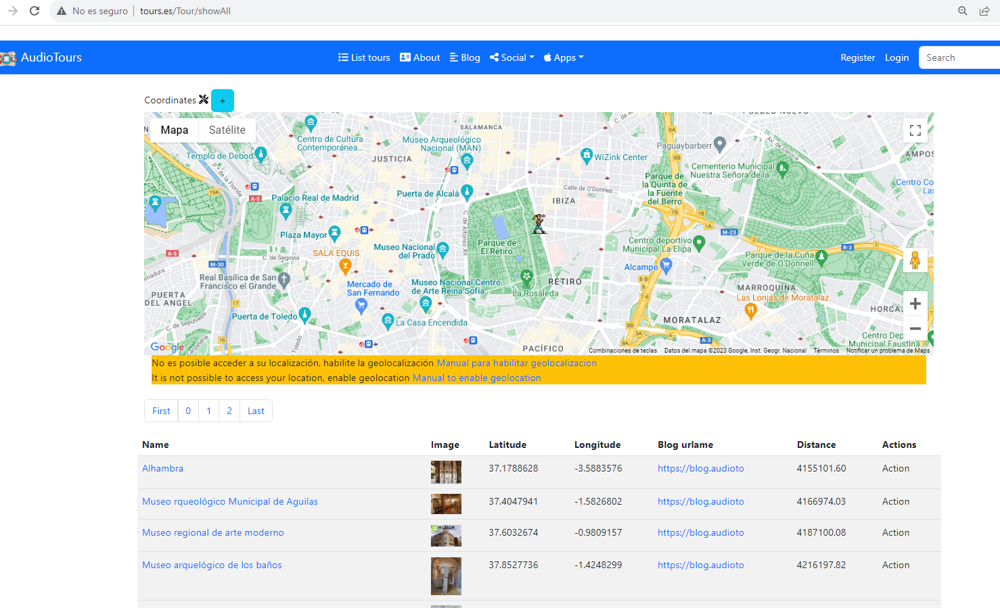
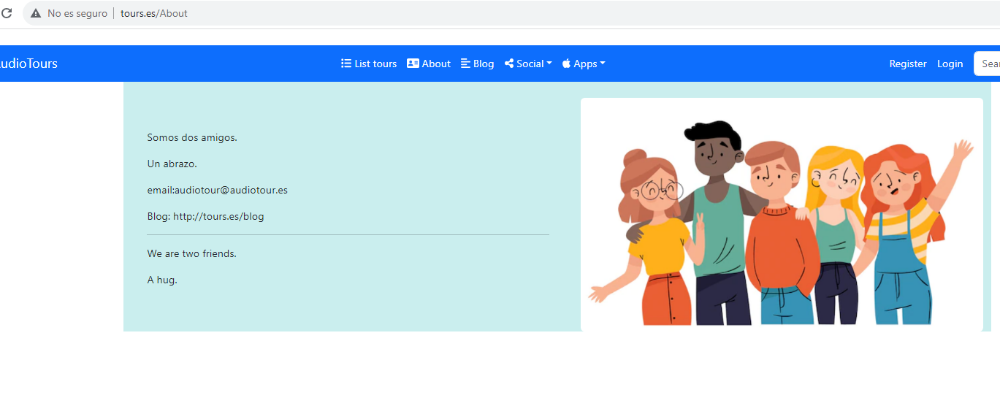

# ¿Que es AudioTours?

Convierte tu teléfono móvil en una guía turística para que te lea en voz alta los aspectos más interesantes del lugar o la zona donde estés.

Turn your mobile phone into a tourist guide to read aloud the most interesting aspects of the place or area where you are.

La aplicación consta de 3 partes:

Backend php+frontEnd html+css+javascript=<a href="https://audiotours.es">audiotours.es</a>

frontend android > 6.0 

Frontend iphone > 9







# Comunicación

Email: <a href="email:adm@audiotours.es">adm@audiotours.es</a>

Telegram: <a href="https://t.me/+6S_Marm6-eo2OTk0">Telegram channel</a>

Slack channel: <a href="https://audiotours-friends.slack.com">Slack audio tour</a>


# Documentación

Se utilizará una mezcla entre El Rational Unified Process y el framework SCRUM.

Para la gestión de la documentación ya no se utilizan documentos de word, ahora Notion se ha convertido en una herramienta fundamental:

<a href="https://large-feather-77f.notion.site/Documentaci-n-proyecto-freetour-4ebf95f7ef7846fe85452afb045594ff">Notion</a>


# Diseño y usabilidad - UI/UX - Minimum Viable Product

Para realizar esto utilizaremos:

<a href="https://miro.com/app/board/uXjVPmzO3ZU=/" target="_blanck">miro.com</a>
<!--<a href="https://miro.com/app/board/uXjVPmzO3ZU=/?share_link_id=798309771385">miro.com</a>-->


# Kanban

El tablero utilizado para seguir los requerimientos del cliente está en el propio github:

<a href="https://github.com/users/kikemadrigal/projects/7/views/1" target="_blanck">Github proyects</a>.


# build and deploy in windows

1. Si estas en xamp ve a C:\Windows\System32\drivers\etc\hosts y pon el nombre de la web:
    ``` 
    ............................................
    #---------------------
    #   virtual hosts
    #--------------------
    127.0.0.1	tours.es
    ............................................
    ```
2. Modifica los host virtuales de C:\xampp\apache\conf\extra\httpd-vhosts.conf
    ```
    ........................
    <VirtualHost *:80>
        DocumentRoot "C:/xampp/htdocs/audiotours"
        ServerName tours.es
    </VirtualHost>
    ........................
    ```
4. Crea una carpeta llamada audiotours dentro de C:\xampp\htdocs y dentro copia los archivos de la carpeta web. 
   dentro crea un index.html con la estructura de una web normal en la que ponga hola desde xamp para probar que funciona. Ve al control panel de xamp y activa el servidor apache y mysql, después ve al navegador y escribe "http://tours.es/".
5. Escribe en el navegador: http://localhost/phpmyadmin/ y crea la base de datos audiotours, cotejamineto utf8_spanish2_ci, pincha en la pestaña sql y ve pega el contenido del archivo backup-2023-05-07..
6. Copia todo el contenido de la carpeta web a la carpeta C:\xampp\htdocs\audiotours.
7.  Selecciona si es desarrollo o produccion en el archivo web/app/config/env.php y pon el nombre del host, de la base de datos, usuario y contraseña en el archivo web/app/config/env.php
8.   Desempaqueta los archivos media/tours/tours-1-parte.zip y  media/tours/tours-2-parte.zip y ponga su contenido de la carpeta media/tours.
9.   Si quieres wordspress api desempaqueta el blog/blog.zip blog y ponga su contenido de la carpeta blog.


