#
# Contenido
[Youtubers, información y recursos	](#_toc180288884)

[Introducción	](#_toc180288885)

[1.¿Qué es Google cloud console?	](#_toc180288886)

[2.Creando nuestro proyecto footballdata	](#_toc180288887)

[3.Instalando nuestras APIS de informes y administración de Google Analytics dentro de tu proyecto de GCP	](#_toc180288888)

[4.Creando nuestras credenciales para poder conectarnos a Google Analytics dentro de tu proyecto de GCP	](#_toc180288889)

[5.¿Qué es Google analytics?	](#_toc180288890)

[6.Acceso a Google analytics de el proyecto de GCP	](#_toc180288891)

[7.Creando nuestro script en pc utilizando python	](#_toc180288892)


#
#
# <a name="_toc180288884"></a>Youtubers, información y recursos

<https://www.youtube.com/@kevinmclaughlin178/videos>

Google cloud Platform: <https://console.cloud.google.com/>

Goole analytics: <https://analytics.google.com/>

Video sobre acceder a la API de Google analytics para utilizar sus datos en tu web: <https://www.youtube.com/watch?v=oRUpAqYqROQ>

Guía rápida sobre Google analytics: https://developers.google.com/analytics?hl=es-419

Guía Google analytics: <https://developers.google.com/analytics/devguides/collection/ga4?hl=es-419>


# <a name="_toc180288885"></a>Introducción

Vamos a obtener en el pc los datos de googole analytics que está asociado a nuestra web y que nos dice las visitas, los lugares donde nos visitan, los dispositivos, etc.

Nuestro objetivo será crear un proyecto Google Cloud Platform (GCP), habilitar las APIs que nos permitirán acceder a Google analytics, crear dentro de GCP una credencial para conectarnos a Google analytics y por útlimo dentro de Google Analytics darle permiso al proyecto GCP y crear un script en Python desde el pc para obtener los datos.

# <a name="_toc180288886"></a>1.¿Qué es Google cloud console?

<https://console.cloud.google.com/>

Google Cloud Console es una plataforma web que permite a los usuarios gestionar y supervisar todos los servicios y recursos de **Google Cloud Platform (GCP)**. GCP es una suite de servicios de computación en la nube que ofrece Google para desarrolladores y empresas que desean construir, implementar y escalar aplicaciones, sitios web, y otros servicios utilizando la infraestructura global de Google.

La consola proporciona una interfaz gráfica donde los usuarios pueden acceder a diversas funcionalidades relacionadas con sus proyectos en la nube. A continuación, algunos aspectos clave de Google Cloud Console:

1. **Gestión de recursos**: Permite crear, configurar y gestionar recursos de Google Cloud, como máquinas virtuales (Compute Engine), bases de datos (Cloud SQL, Firestore), almacenamiento (Cloud Storage), y muchos otros servicios.
1. **Monitorización y análisis**: Ofrece herramientas para supervisar el rendimiento de los servicios en tiempo real, analizar logs, visualizar gráficos de uso, y recibir alertas sobre el estado de los recursos. Por ejemplo, se puede monitorear el uso de CPU, memoria, o almacenamiento de una aplicación.
1. **Facturación y costos**: Los usuarios pueden revisar los costos de sus servicios en la nube, gestionar presupuestos, configurar alertas de gasto y acceder a informes detallados sobre el uso de los recursos para optimizar el costo.
1. **Seguridad y acceso**: Facilita la configuración de permisos y roles mediante **Identity and Access Management (IAM)**, lo que permite gestionar quién tiene acceso a qué recursos en la plataforma. También incluye herramientas de seguridad para proteger los proyectos, como la configuración de firewalls, claves de API, y auditoría de accesos.
1. **Desarrollo y despliegue**: Los usuarios pueden desarrollar, probar y desplegar aplicaciones en la nube, utilizando servicios como Google Kubernetes Engine (GKE) para contenedores, App Engine para aplicaciones sin servidor, y Cloud Functions para funciones basadas en eventos. Todo esto se gestiona fácilmente desde la consola.
1. **Integración con otros servicios de Google**: Google Cloud Console se integra con otros servicios de Google, como BigQuery (para análisis de grandes volúmenes de datos), AI Platform (para machine learning), y muchos más.
1. **Comandos en la terminal**: Incluye una terminal integrada de **Google Cloud Shell** que permite ejecutar comandos directamente sobre los recursos del proyecto desde el navegador sin necesidad de configuraciones locales.

En resumen, Google Cloud Console es una herramienta fundamental para quienes utilizan Google Cloud Platform, ya que facilita la administración y supervisión de los recursos en la nube, simplificando el proceso de creación y despliegue de aplicaciones a gran escala.


Google cloud tiene un montón de Apis públicas como la de los mapas para que salga un mapa en tu web, la autencticación o u puente entre Google analytics para ver las analíticas, vamos a crear un proycto nuevo:

Escribimos en Google Google cloud platform, pinchamos en el primer enlace que sale, en la web que se nos abre pinchamos en consile:

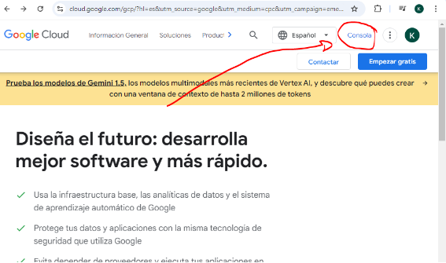

Pinchamos en el menú en descripción general y en panel:

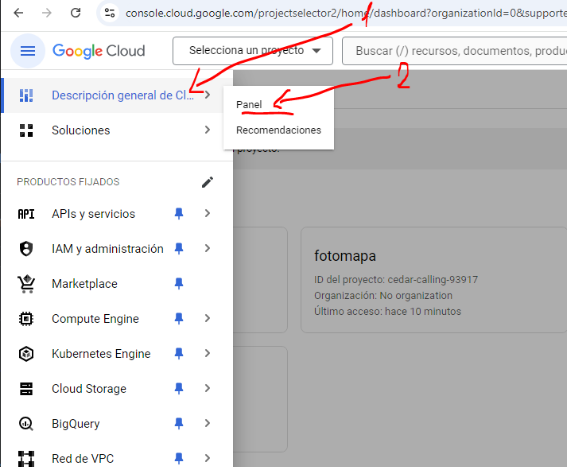

Pinchamos en seleccionar producto (1) y en la página de administrar recursos (2):

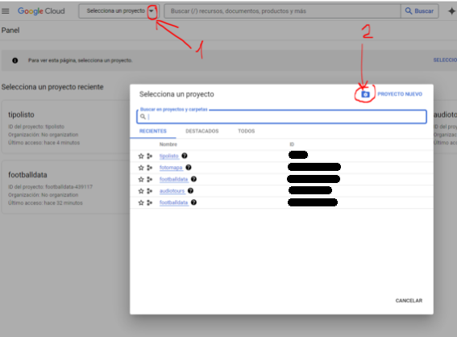
# <a name="_toc180288887"></a>2.Creando nuestro proyecto footballdata
Ahora pinchamos en crear un proyecto nuevo:

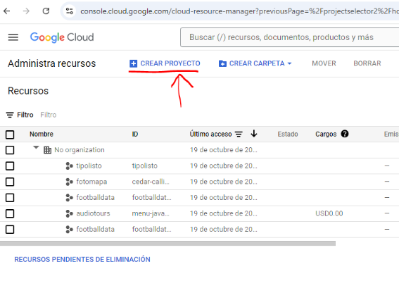

Le ponemos el nombre de nuestro proyecto:


Ahora en la parte superior podemos ver nuestro nuevo proyecto:

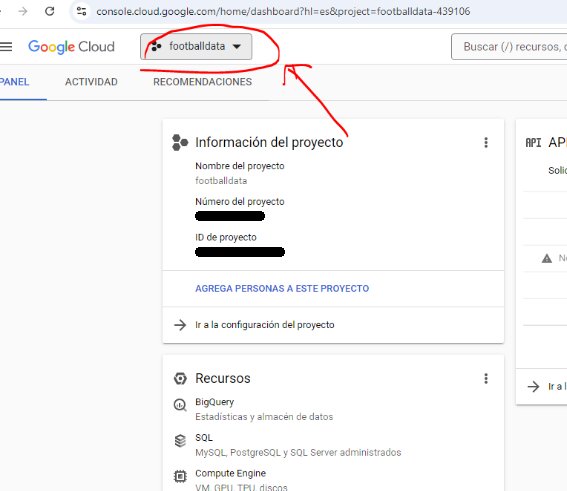


# <a name="_toc180288888"></a>3.Instalando nuestras APIS de informes y administración de Google Analytics dentro de tu proyecto de GCP

Necesitamos decirle a nuestro proyecto que utilice Google Analytics para la Api de informes de Google Analytics, pinchamos en APIs y services->Apis y servivos habilitados:

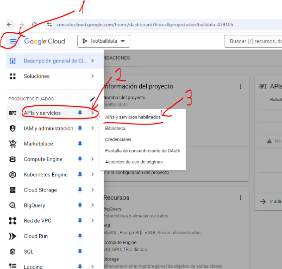

Pinchamos en Habilitar APIs y servicios


Buscamos Google analytics ypinchamos sombre Google Analytics Reposrt API:

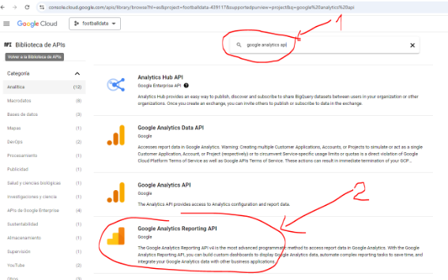

Pinchamos en habilitar:

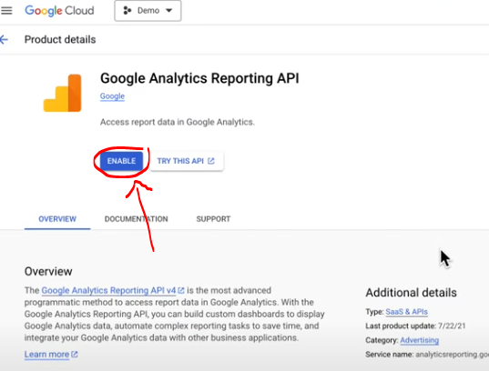

Hay otra API que nos es relevante para los informes pero puede ayudarte a configurar las propiedades de Google analytics como configurar las dimensiones personalizadas y esa es la API de Google analytics Admin API:

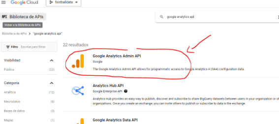

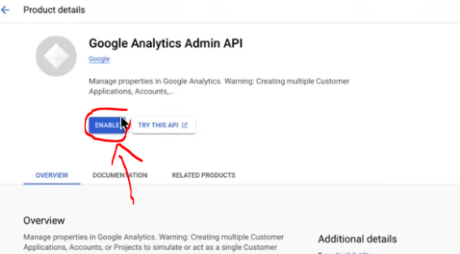

# <a name="_toc180288889"></a>4.Creando nuestras credenciales para poder conectarnos a Google Analytics dentro de tu proyecto de GCP

Ahora necesito crear una credencial de cuenta de servicio para poder conectarme a Google analytics:

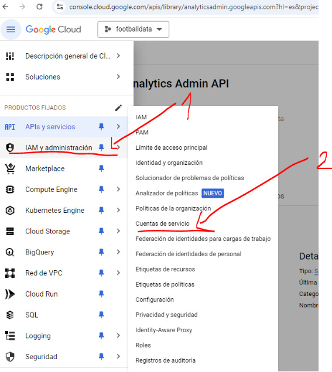

Pinchamos en Crear una nueva cuenta de servicio:

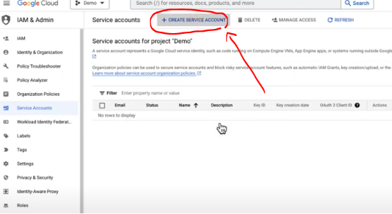

Escribimos cuenta de servicio googe analytics y pinchamos en continuar

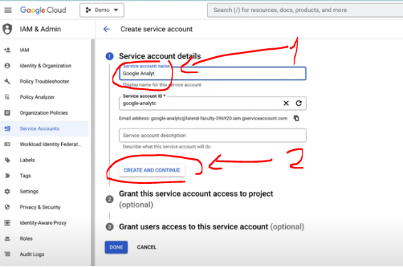

Le decimos que el que va a acceder al servicio es el propietario:


Y continuar

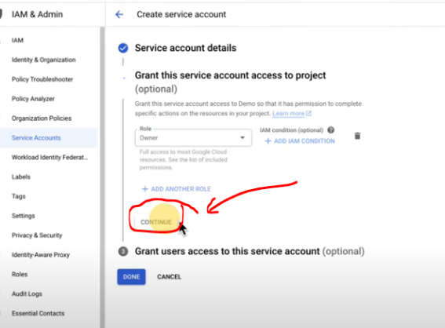

El paso 3 lo dejamos en blanco y  terminamos en pinchando Hecho:

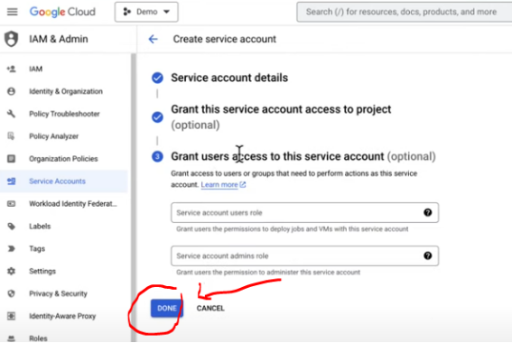

Ya hemos creado la cuenta de servicio, ahora necesitamos las claves para esta credencial de cuenta de servicio, pinchamos sobre la credencial para entrar en ella


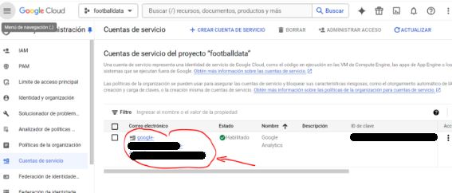

Y pinchamos en Claves:

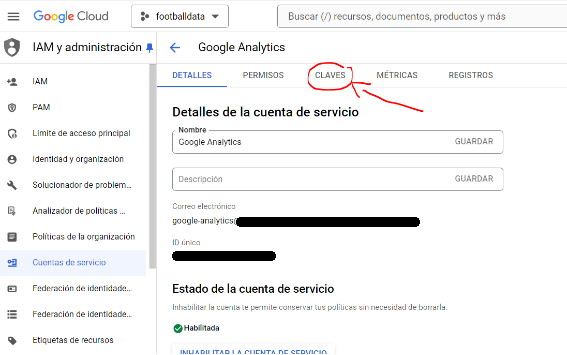

Ahora en Add key y en Create new Key:

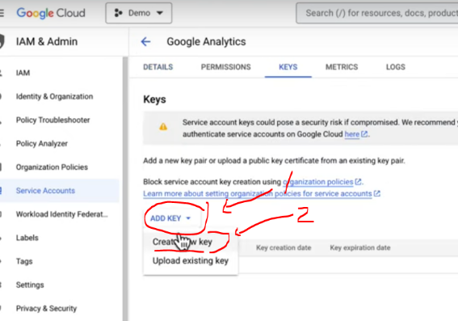

Seleccionamos Json y pinchamos en Create:

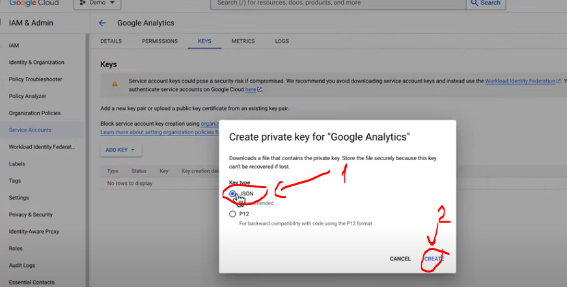

Comenzará a descargase el archivo json:

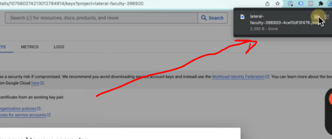

Abrimos el archivo descargado  y copiamos elcleinte\_email:

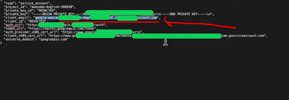

Vamos a Google analytics 


# <a name="_toc180288890"></a>5.¿Qué es Google analytics?
<https://analytics.google.com/>

Video sobre acceder a la API de Google analytics para utilizar sus datos en tu web: <https://www.youtube.com/watch?v=oRUpAqYqROQ>

Google Analytics es una herramienta gratuita de análisis web proporcionada por Google que permite a los propietarios de sitios web y aplicaciones móviles medir y analizar el tráfico y comportamiento de los usuarios en sus plataformas. Con Google Analytics, los administradores pueden obtener información detallada sobre cómo los visitantes interactúan con su contenido, incluyendo datos como:

- **Cantidad de visitas**: Cuántas personas visitan el sitio web.
- **Origen del tráfico**: Desde dónde llegan los usuarios (búsqueda orgánica, redes sociales, anuncios pagados, etc.).
- **Páginas vistas**: Cuáles son las páginas más visitadas.
- **Duración de las sesiones**: Cuánto tiempo pasan los usuarios en el sitio.
- **Comportamiento del usuario**: Qué acciones realizan, como clics, desplazamientos, etc.
- **Conversiones**: Seguimiento de objetivos importantes como compras, registros o cualquier otra acción clave para el negocio.

Google Analytics también ofrece herramientas para segmentar a los usuarios según distintos criterios, realizar análisis en tiempo real y obtener informes personalizados para tomar decisiones basadas en datos. Además, se puede integrar con otras herramientas de Google, como Google Ads, para medir el rendimiento de campañas publicitaria


# <a name="_toc180288891"></a>6.Acceso a Google analytics de el proyecto de GCP
Seleccionamos nuestro proyecto y pinchamos en configuración:

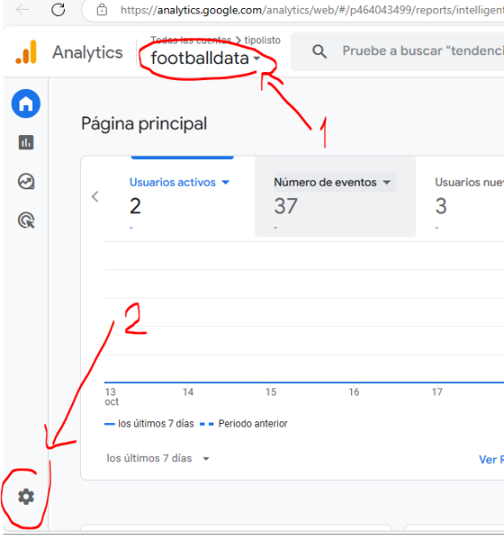

En administrar pinchamos en Gestión de accesos a la cuenta:

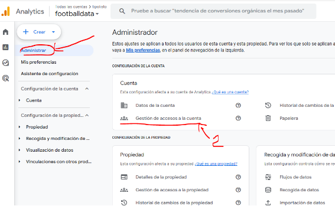

Pinchamos en el + y en añadir usuario que está arriba a la derecha:

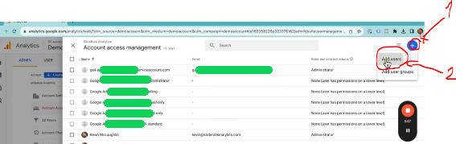


Y pegamos el correo que hemos copiado antes y elegimos administrador 

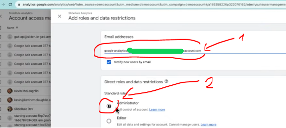


# <a name="_toc180288892"></a>7.Creando nuestro script en pc utilizando python

Copiamos nuestro id de propiedad para configurar el cliente Python

Vamos a Propiedad->Detalles de la propiedad y copiamos el id:

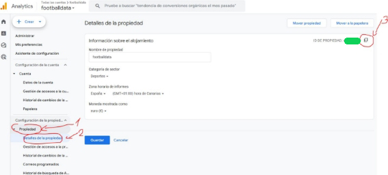

Para ver como funciona la librería, vamos a esta web para copiar el código python:

<https://developers.google.com/analytics/devguides/reporting/data/v1/quickstart-client-libraries?hl=es-419>

También puedes ir a github: 

<https://github.com/googleanalytics/python-docs-samples/tree/main>

Crea un nuevo proyecto Python, ya sabes

1. Python -m venv .\venv
1. Venv\Scripts\activate
1. Dentro de Vscode Ctr+shift+p y escribe Python select interpreter y selección (venv)
1. pip install Google-analitics-data
1. Pega dentro el archivo con las credenciales (renombra el archivo que tiene un nombre muy largo) que te has descargado en el punto 4, si no encuentras el archivo.json ve de nuevo a tu credencial de tu proyecto de GCP y pincha en la pestaña claves, borra el archivo.json generado y crea otro nuevo.

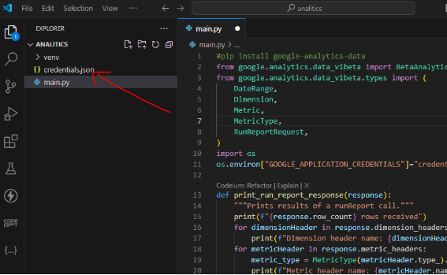

1. Crea el archivo main.py y ponle este código:
```python	
#pip install google-analytics-data
from google.analytics.data_v1beta import BetaAnalyticsDataClient
from google.analytics.data_v1beta.types import (
    DateRange,
    Dimension,
    Metric,
    MetricType,
    RunReportRequest,
)
import os
os.environ["GOOGLE_APPLICATION_CREDENTIALS"]="credentials.json"º

def print_run_report_response(response):
    """Prints results of a runReport call."""
    print(f"{response.row_count} rows received")
    for dimensionHeader in response.dimension_headers:
        print(f"Dimension header name: {dimensionHeader.name}")
    for metricHeader in response.metric_headers:
        metric_type = MetricType(metricHeader.type_).name
        print(f"Metric header name: {metricHeader.name} ({metric_type})")

    print("Report result:")
    for rowIdx, row in enumerate(response.rows):
        print(f"\nRow {rowIdx}")
        for i, dimension_value in enumerate(row.dimension_values):
            dimension_name = response.dimension_headers[i].name
            print(f"{dimension_name}: {dimension_value.value}")

        for i, metric_value in enumerate(row.metric_values):
            metric_name = response.metric_headers[i].name
            print(f"{metric_name}: {metric_value.value}")

def report1(property_id):
    client = BetaAnalyticsDataClient()
    request = RunReportRequest(
        property=f"properties/{property_id}",
        dimensions=[Dimension(name="city")],
        metrics=[Metric(name="activeUsers",)],
        date_ranges=[DateRange(start_date="2020-03-31", end_date="today")],
    )
    response = client.run_report(request)
    print_run_report_response(response)

def report2(property_id):
    client = BetaAnalyticsDataClient()
    request = RunReportRequest(
        property=f"properties/{property_id}",
        #dimensions=[Dimension(name="city")],
        dimensions=[
            Dimension(name="country"),
            Dimension(name="date"),
            Dimension(name="deviceCategory"),
            Dimension(name="operatingSystem"),
            Dimension(name="browser"),
            Dimension(name="city"),
            Dimension(name="region")

        ],
        metrics=[
            Metric(name="activeUsers"),
            Metric(name="newUsers"),
            Metric(name="totalRevenue")
        ],
        date_ranges=[DateRange(start_date="2020-03-31", end_date="today")],
    )
    response = client.run_report(request)
    print_run_report_response(response)

if __name__ == "__main__":
    property_id="464043499"
    report1(property_id)

```


7\.Modifica el código y donde pone os.environ["GOOGLE\_APPLICATION\_CREDENTIALS"]="credentials.json" pon el nombre de tu archivo json

Y onde pone 

if \_\_name\_\_ == "\_\_main\_\_":

`    `property\_id="463044299"

`    `report1(property\_id)

pon tu número de property\_id del punto 6.

Fin:

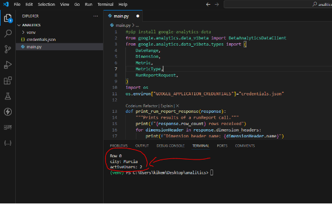
