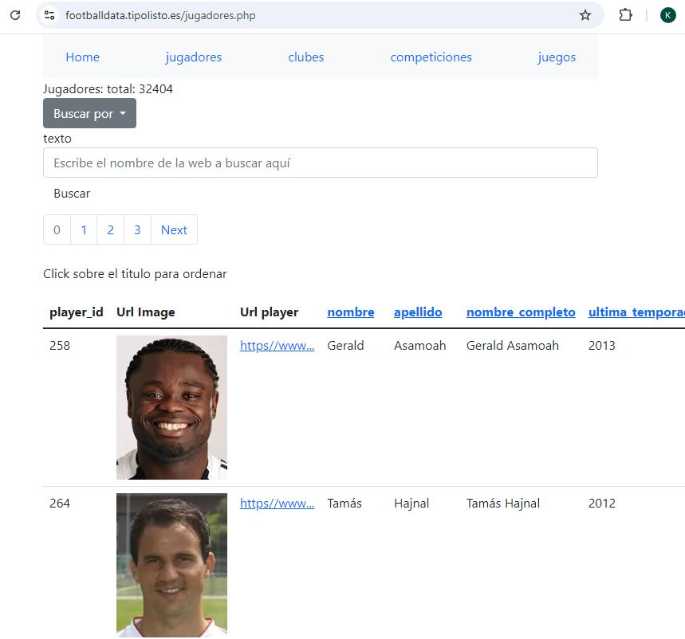
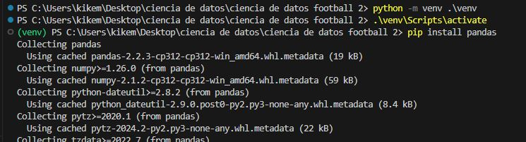

# Que es footballdata

Futbol data es el proyecto de una web inventada por el gran Carlos para ganar pasta a manta y el estrellato personal que nos llevará a la fama, prometemos seguir siendo humildes.

https://footballdata.tipolisto.es/jugadores.php



La parte desktop es tan solo una aplicación python jupiter notebook para crear la base de datos football-data.sqlite que después pondremos en el servidor web.

Al mismo tiempo eestudiar la ciencia de datos y las partes en que se compone:

1. Recolección de datos
2. Limpieza y preparación de datos
    1. Modificar nombres de columnas
    2. Llenar datos faltantes, quitar valores nulos, sustituir nulos por media
    3. Categorizar datos
    4. Eliminar datos
3. Ni idea
4. Ni idea
5. Ni idea
6. Si quieres estudiar la ciencia de datos, mira antes estos vídeos: 

    https://www.youtube.com/watch?v=gGnyfnaRFVw&list=PLFRK6BqDHNnKzUl4zaUT-HvVOICDo2zUn&index=6

    https://www.youtube.com/watch?v=kqA3NdaMh3c&list=PLFRK6BqDHNnKzUl4zaUT-HvVOICDo2zUn&index=7

    o esta serie de vídeos: https://www.youtube.com/playlist?list=PLFRK6BqDHNnKzUl4zaUT-HvVOICDo2zUn


Este proyecto se compone de 2 partes:

1. Parte de escritorio

2. Parte web


# Parte de escritorio

1. Para la obtención de los datos navegamos por la web de kaggle y descargamos los datasets: https://www.kaggle.com/datasets/davidcariboo/player-scores
   , también puedes descargar los datasets de https://footballdata.tipolisto.es/assets/datasets.zip, la carpeta datasets con los archivos.csv tiene que estar dentro de la carpeta desktop/assets/


2. Estudiamos un poco la estructura del dataset:


3. Dentro de vscode instalamos los complementos de jupyter notebook para trabajar con archivos.ipynb y SQLite Viewer para explorar la base de datos sqlite
4. En vscode vamos a File-> New file...->Jupyter Notebook
5. Desde el cmd o terminal creamos un entorno virtual con python -m venv .\venv
6. Activamos el entorno virtual con venv\Scripts\activate
7. Seleccionamos el interprete de python en vscode que en jupiter notebook, aparece arriba a la derecha o Ctrl+Shift+P y escribe python interpreter para selccionar el env
8. instalamos pandas, pandasql, sqlalchemy, seaborn y matplotlib
9. 
10. Al ejecutar el código por primera vez nos pedirá instalar el iKernel de jupyter y le decimos que si
11. Si kieres acceder a los datos de google analytics, primero estúdia que es pinchando aquí: https://github.com/kikemadrigal/footballdata/docs/analytics-tutorial/google-analytics.md , habla con el rapiñador para que te proporciene las claves, despues haz un pip install pip install google-analytics-data ejecuta el archivo analytics.py, otra opción es probar el programa que tienes emn releases  https://github.com/kikemadrigal/Python-desktop-web-php-footballdata/releases/download/v.0.0.1/footballdata-analytics.zip
Crea el ejecutable de analíticas primero installado pyinstaller (pip install pyinstaller) y con: PyInstaller --onefile --console --icon=assets\icon.ico  --clean -y -n "footbaldata-analytics" --add-data "credentials.json;."  .\analytics.py 


# Parte web

1. Instala el complemento para VSCode "FTP-sync" 
   


2. Ponte en contacto con el rapiñador para obtener el archivo ftp-sync.json que tendrás que poner en la carpeta web/.vscode para que se sincronicen los datos con el servidor.
3. Si al guardar no se actualiza pincha en Crtl+Shift+p y escribe en la paleta de comandos Ftp-sync: upload file

# Cosas raras

## ¿Que es Pandas?

Te permite trabajar como si estuvieras en una hoja de cálculo


## ¿Que es un dataframe?

Es una hoja de calculo.


```
import pandas as pd

diccionario = {
    "columna1": ["0-0","1-0", "3-0","4-0","5-0","6-0","7-0","8-0","9-0"],
    "columna2": ["0-1","1-1", "3-1","4-1","5-1","6-1","7-1","8-1","9-1"],
    "columna3": ["0-3","1-3", "3-3","4-3","5-3","6-3","7-3","8-3","9-3"],
    "columna4": ["0-4","1-4", "3-4","4-4","5-4","6-4","7-4","8-4","9-4"],
    "columna5": ["0-5","1-5", "3-5","4-5","5-5","6-5","7-5","8-5","9-5"],
    "columna6": ["0-6","1-6", "3-6","4-6","5-6","6-6","7-6","8-6","9-6"],
}

df = pd.DataFrame(diccionario)
```


