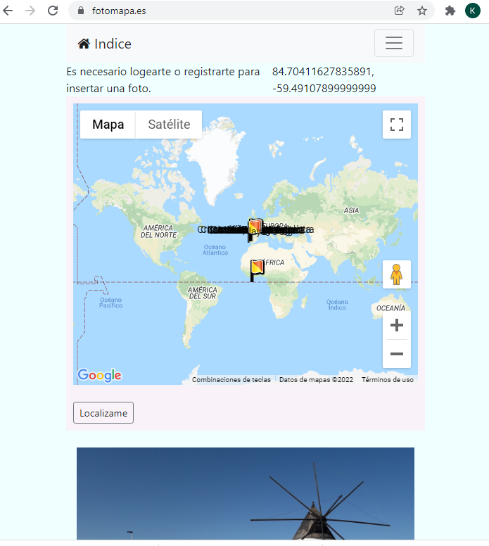
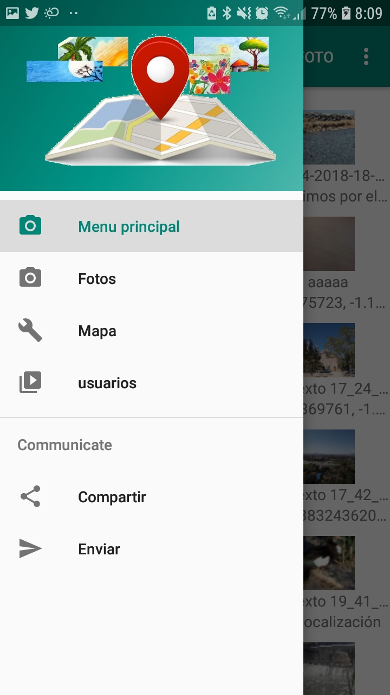
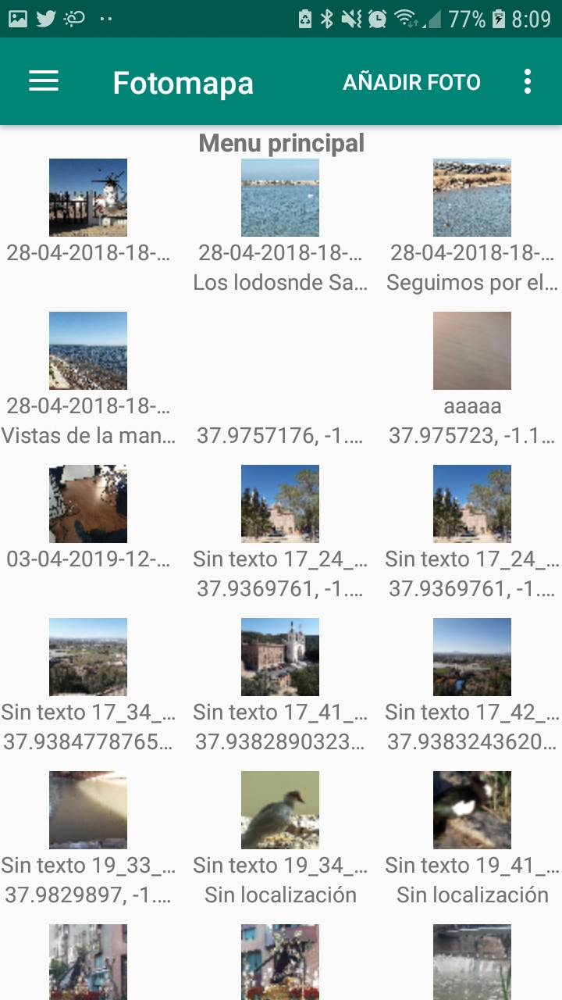

# Descripción

Fotomapa está compuesto por un backend y un frontend

## Backend

En la parte backend tenemos una web creada con mi propio framework php [Fotomapa.es](https://fotomapa.es/)

Para obtener información sobre el desarrollo de esta web ir a:

## Frontend

Esta web se comunica con la aplicación  
[Fotomapa](https://github.com/kikemadrigal/FotomapaJava/tree/master/app/build/outputs/apk/debug/app-debug.apk)
para que puedas compartir tus fotos con tu amigos.
 

Para obtener información sobre el desarrollo de esta app ir a:

