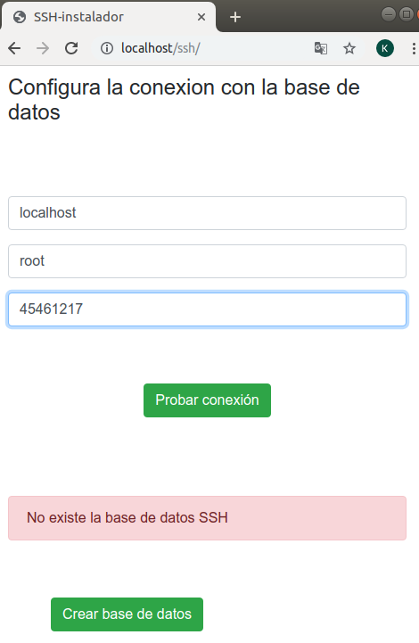
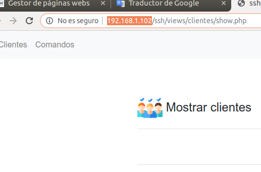
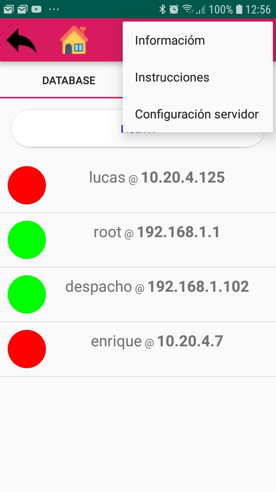
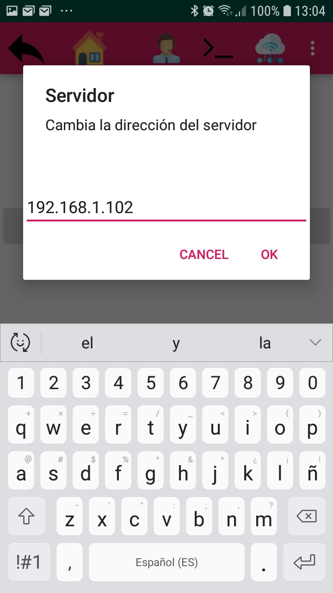
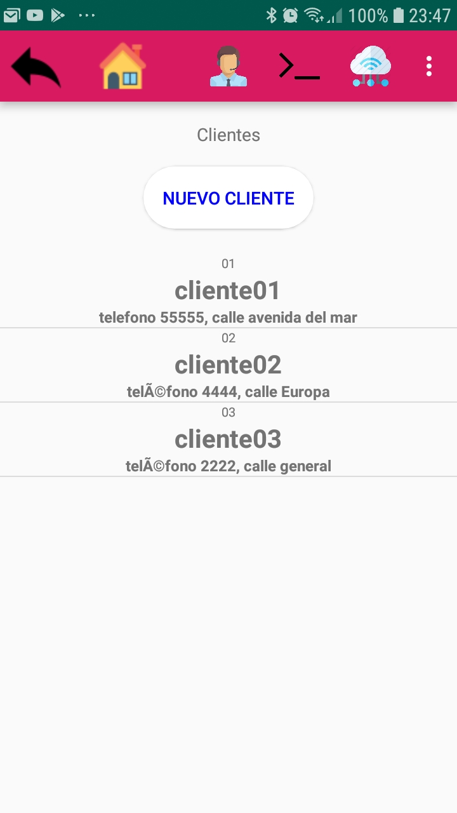
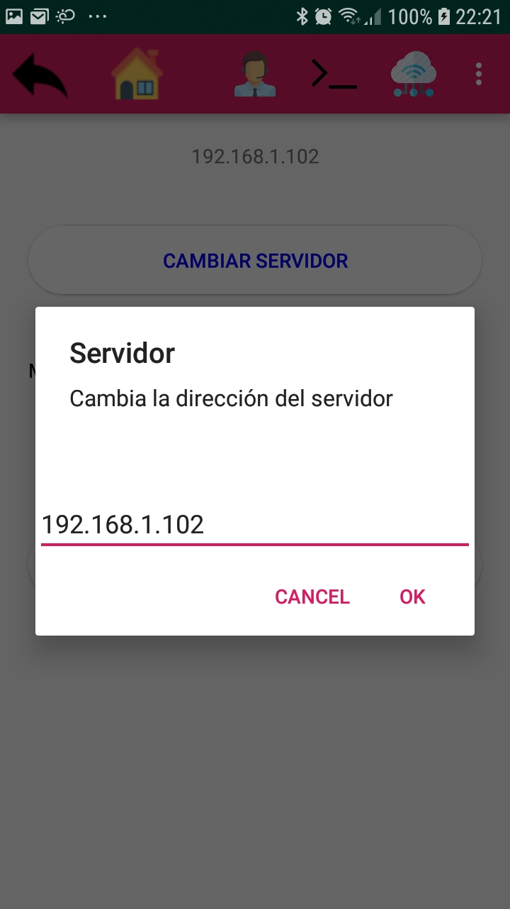
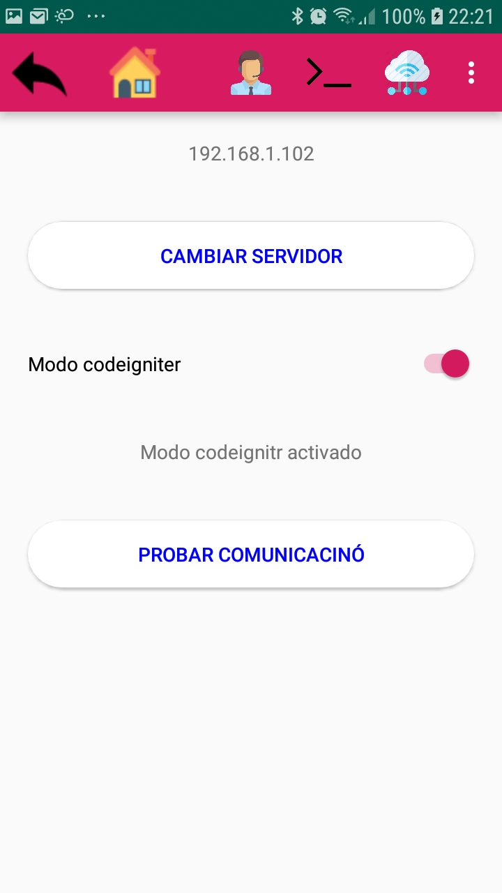

# Descripción

Permite ejecutar comandos en ordenadores remotos a través de Secure Shell, también tiene un base de datos local con los equipos y una base de datos remota con los clientes y los comandos (carpeta ssh) , también he incorporado la misma versión de la web en codeigniter solamente por motivos pedadógicos.

# Instalación

Consta de 3 paquetes:

1: Parte android [SSH para android] (https://github.com/kikemadrigal/ssh/releases/tag/0.0.1)

2: Parte web: carpeta ssh

3: Parte web : carpeta sshcode

## Parte android

Muestra la interface para ejecutar los comandos y los clientes.
Simplemente descarga el apk desde [aquí] (https://github.com/kikemadrigal/ssh/releases/tag/0.0.1) en tu dispositivo móvil e instálalo, deberás  tener habilitada la opción de ejecutar aplicaciones desconocidas en tu dispositivo móvil.
El apk (proyecto empquetado y compilado para android) también se encuentra en sshandroid/app/build/outputs/apk/debug

## Parte Web

Necesitarás un equipo con un MariaDB/Mysql y un servidor web con apache para ofrecer el API REST.
Tan solo tienes que copiar y pegar la carpeta ssh en tu servidor web, al poner en el navegador http://localhost/ssh te aparecerá el instalador, ve a "Parte 2, servidor web (con los clientes y los comandos)" para obtener una información más detallada.
Si eres más atrevido puedes copiar y pegar la carpeta sshcode en tu servidor web, para más información ve a la parte "Parte 3, servidor web hecho con codeigniter"

# Parte 2, servidor web (con los clientes y los comandos)
---
Este es el segundo paquete de la aplicación ssh para android

## Instalación
---
### Descarga la última versión
---
Para descargar el proyecto entero pincha en el botón Clone or download de github y en Download ZIP, descomprímelo y pega la carpeta ssh con todo su contenido en tu servidor web.
En el caso de apache2 para ubuntu debes de pegar esta carpeta en /var/www/html:

### Configrando la base de datos
---
Ahora ve al navegadoir web y escribe localhost/ssh en la barra de direcciones:

Prueba la conexión de la base de datos

Crea la base de datos

Vamos a ver los clientes, picha en ir a la página principal:

# Configurando la aplicación android

## Obtener la ip de tu servidor
Dentro de la web pincha en clientes (que está en el menú superior):
Verás como aparece una dirección ip en la barra de dirección, en este caso es 192.168.1.102:

Dentro de la aplicación android pincha en los 3 puntos (el menú) y elige Configuración servidor:

Dentro escribe la dirección anterior:

Ahora pincha en clientes y en c¡omando y podrás verlos:

# Parte 3, servidor web hecho con codeigniter

# Instalación y configuración
La configuración de este proyecto es complicada y exigede un conocimiento elevado de apache, php y codeigniter.

## Descarga el proyecto
Descarga el proyecto entero pichando en el botón Clone or Download que aparece arriba de esta página, copia y pega la carpeta sshcode en tu servidor web, en el caso de apache2 para ubuntu debes de pegar esta carpeta en /var/www/html.

## Habilita las rutas amigables
1. Habilitar mod_rewrite con el siguiente comando:
sudo a2enmod rewrite
2. Abrir el archivo de configuración de apache con el siguiente comando:

sudo nano /etc/apache2/apache2.conf

    2.1. Descomentar la linea (remueve el simbolo #)

AccessFileName .htaccess  

    2.2. Encuentra la siguiente sección

<Directory /var/www/>  
     Options Indexes FollowSymLinks  
     AllowOverride None  
     Require all granted  
</Directory>  
Nota: la sección anterior también la puedes encontrar en el archivo:

Reemplaza “None” por “All” :

AllowOverride All

    2.3. Reinicia el servicio de Apache con el siguiente comando:

sudo service apache2 restart

3. creamos el archivo .htaccess en la raiz de nuestra web con el siguiente contenido:

Options FollowSymLinks
<IfModule mod_rewrite.c>  
    RewriteEngine on  
    RewriteCond %{REQUEST_FILENAME} !-f  
    RewriteCond %{REQUEST_FILENAME} !-d  
    RewriteRule ^(.*)$ index.php/$1 [L]  
</IfModule>  

## Crea y rellena la base de datos
Dentro de workbench o phpmyadmin, tendrás que ejecutar las siguientes sentencias SQL:
1. Crear la base de datos SSH:
~~~
CREATE SCHEMA `ssh` DEFAULT CHARACTER SET utf8 ;

2. Crea y rellena la tabla clientes:
CREATE TABLE `clientes` (
  `id` int(11) NOT NULL AUTO_INCREMENT,
  `cif` varchar(50) NOT NULL,
  `nombre` varchar(255) NOT NULL,
  `datos` varchar(255),
  PRIMARY KEY (`id`)
) ENGINE=InnoDB DEFAULT CHARSET=utf8;

INSERT INTO `clientes` (`id`, `cif`, `nombre`, `datos`) VALUES
(1, '01', 'cliente01', 'telefono 55555, calle avenida del mar'),
(2, '02', 'cliente02', 'teléfono 4444, calle Europa'),
(3, '03', 'cliente03', 'teléfono 2222, calle general');

3. crea y rellena la tabla Comandos:
CREATE TABLE `comandos` (
  `id` int(11) NOT NULL AUTO_INCREMENT,
  `nombre` varchar(255) NOT NULL,
  `datos` varchar(255),
  PRIMARY KEY (`id`)
) ENGINE=InnoDB DEFAULT CHARSET=utf8;

INSERT INTO `comandos` (`id`, `nombre`, `datos`) VALUES
(1, 'ls', 'comando par alistar el contenido de un directorio'),
(2, 'pwd', 'Comando para ver el distorio actual'),
(3, 'php -v', 'comando para ver la versión de php instalada');

4. Crea y rellena la tabla clientesComandos:
CREATE TABLE `clientesComandos` (
  `id` int(11) NOT NULL AUTO_INCREMENT,
  `idCliente` int(11) NOT NULL,
  `idComando` int(11) NOT NULL,
  PRIMARY KEY (`id`),
  KEY `fkClientesComandosClientes` (`idCliente`),
  KEY `fk_clientesComandosComandos` (`idComando`),
  CONSTRAINT `fkClientesComandosClientes` FOREIGN KEY (`idCliente`) REFERENCES `clientes` (`id`) ON DELETE CASCADE ON UPDATE CASCADE,
  CONSTRAINT `fk_clientesComandosComandos` FOREIGN KEY (`idComando`) REFERENCES `comandos` (`id`) ON DELETE CASCADE ON UPDATE CASCADE
) ENGINE=InnoDB AUTO_INCREMENT=19 DEFAULT CHARSET=utf8;

INSERT INTO `clientes-comandos` (`id`, `id_cliente`, `id_comando`) VALUES
(1, 1, 2),
(2, 1, 3),
(3, 2, 1);
~~~

## Configura codeigniter

En el archivo application/config/database.php Configura la conexión de la base de datos:  

~~~

$active_group = 'default';
$query_builder = TRUE;

$db['default'] = array(
	'dsn'	=> '',
	'hostname' => 'localhost',
	'username' => 'TU_USUARIO',
	'password' => 'TU_CONTRASEÑA',
	'database' => 'ssh',
	'dbdriver' => 'mysqli',
	'dbprefix' => '',
	'pconnect' => FALSE,
	'db_debug' => (ENVIRONMENT !== 'production'),
	'cache_on' => FALSE,
	'cachedir' => '',
	'char_set' => 'utf8',
	'dbcollat' => 'utf8_general_ci',
	'swap_pre' => '',
	'encrypt' => FALSE,
	'compress' => FALSE,
	'stricton' => FALSE,
	'failover' => array(),
	'save_queries' => TRUE
);

~~~

Otras configuraciones que están guardadas y que deben de aparecer son:  

En el archivo application/config/config.php cambia la base_url y el index_page:  
$config['base_url'] = 'http://localhost/sshcode/';  
$config['index_page'] = '';  

En el archivo  application/config/autoload.php utiliza las librerias database y el helper url para no tener que importarlas en ningún archivo:  

~~~

$autoload['libraries'] = array('database','session');  
$autoload['helper'] = array('url');  
$autoload['model'] = array('Clientes_model', 'Comandos_model', 'ClientesComandos_model');  

~~~

##Configura la aplicación android

Dentro de la aplicación android pincha en los 3 puntos (el menú) y elige Configuración servidor:

Obtén la ip de tu host (en ubuntu ifconfig) y pégala:

Cambia a modo codeigniter:

